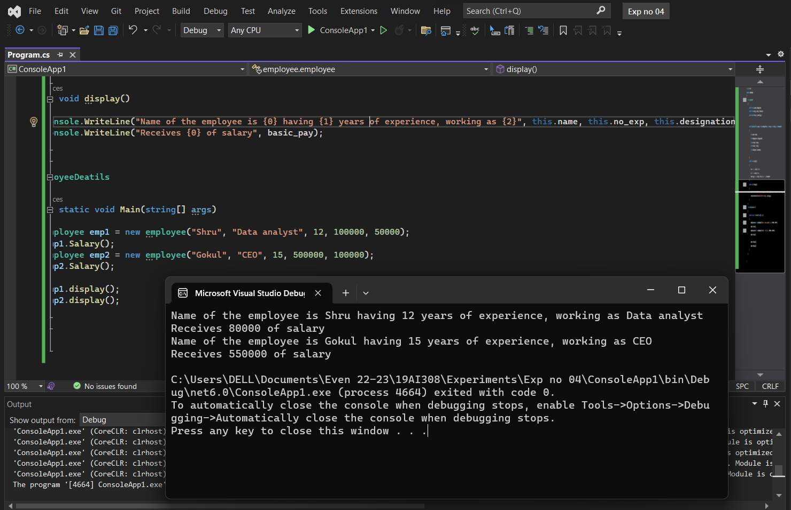

# Ex 04-CONSTRUCTOR
## AIM:
 To write a C# program to calculate the salary of an employee by passing the name, designation, noofexperience, basic salary and insurance amount through constructor.
 
## ALGORITHM:
### Step 1:
Create a class and a constructor.

### Step 2:
Get name, designation, experience, basic salary and insurance amount from the User.

### Step 3:
Call salary method in constructor to calculate salary.

### Step 4:
Call display method to display the output.

### Step 5:
Stop the program.
 ## PROGRAM:
 ```
using System;
namespace Constructor
{
    public class employee
    {
        public string name, designation;
        public int exp, bs, ins, hra = 0, ta = 0, s = 0;
        void salary(int bs, int ins)
        {
            hra = (20 * bs) / 100;
            ta = (10 * bs) / 100;
            s = bs + hra + ta - ins;
        }
        void display()
        {
            Console.WriteLine("Name of the employee is " + this.name + " having " + this.exp + " of experience, working as " + this.designation);
            Console.WriteLine("Receives " + s + " of salary");
        }
        public employee(string name, string designation, int exp, int bs, int ins)
        {
            this.name = name;
            this.designation = designation;
            this.exp = exp;
            this.bs = bs;
            this.ins = ins;
            salary(bs, ins);
            display();
        }

    }
    public class program
    {
        static void Main(String[] args)
        {
            string nam, desig;
            int exp, bs, ins, n;
            Console.WriteLine("Enter no of employees: ");
            n = Convert.ToInt32(Console.ReadLine());
            for (int i = 1; i <= n; i++)
            {
                Console.WriteLine("Enter name of the employee: ");
                nam = Console.ReadLine();
                Console.WriteLine("Enter designation of the employee: ");
                desig = Console.ReadLine();
                Console.WriteLine("Enter years of experience of the employee: ");
                exp = Convert.ToInt32(Console.ReadLine());
                Console.WriteLine("Enter basic salary of the employee: ");
                bs = Convert.ToInt32(Console.ReadLine());
                Console.WriteLine("Enter insurance: ");
                ins = Convert.ToInt32(Console.ReadLine());
                employee emp = new employee(nam, desig, exp, bs, ins);
            }


        }
    }
}

```
## OUTPUT:
 
## RESULT:
Thus, the C# program to calculate the salary of an employee by passing the name, designation, noofexperience, basic salary and insurance amount through constructor is executed successfully.